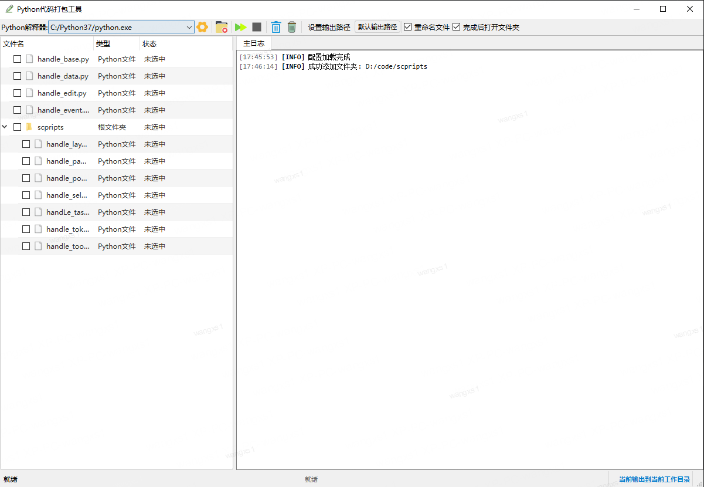

# 🔏 Python 代码保护 

## 📸 页面展示


## 🎯 功能概述

### 🐍 Python 环境管理
- 🔧 多解释器支持：可添加、编辑、删除多个Python解释器路径
- 🧪 路径验证：自动检测Python解释器是否可用并显示状态
- 💾 持久化配置：自动保存Python路径配置和最后选择项

### 📁 脚本管理
- 🌲 树形结构展示：以树形结构可视化展示文件夹中的Python脚本
- 🔄 动态加载：支持展开文件夹时动态加载内容
- 🔍 文件过滤：自动识别并只显示.py文件
- 📚 多根目录支持：可同时添加多个根文件夹进行管理

### 🔐 加密功能
- ⚡ 单脚本加密：双击或右键菜单加密单个脚本
- 🚀 批量加密：支持勾选多个脚本进行批量顺序加密
- 📈 实时输出：实时显示脚本加密的标准输出和错误输出
- 📄 文件重命名：支持生成的加密文件与源文件相同，只修改后缀
- 📁 路径定制：支持指定输出路径

### 🎨 界面展示
- 📊 状态栏提示：实时显示执行状态和信息
- 🎪 彩色日志：不同级别日志使用不同颜色显示
- 📑 多标签页：每个加密任务在独立标签页中显示

### ⚡ 高级特性
- 🧵 多线程执行：使用独立线程执行脚本，避免界面卡顿
- ⏸️ 执行控制：支持停止正在执行的脚本
- 🚨 错误处理：完善的异常处理和用户提示
- 💻 跨平台支持：支持Windows、macOS和Linux系统

## 📋 本代码系统要求
- 🐍 Python 3.7+
- 📦 PyQt6 库
- 💻 支持的操作系统：Windows 10+/macOS 10.14+/Linux

## 📥 安装步骤
1. 克隆或下载本项目代码
2. 安装所需依赖：`pip install PyQt6`
3. 运行主程序：`python run.py`

## 🎯 使用流程
1. **添加Python解释器**：点击工具栏上的 ⚙️ 设置Python路径 按钮，添加您的Python解释器路径
2. **选择Python解释器**：下拉选择加密的版本（即你需要的Python版本）
3. **浏览脚本文件夹**：点击 📁 文件夹图标，选择包含Python脚本的目录
4. **加密单个脚本**：右键树形结构中的脚本文件，选择加密此文件
5. **批量执行**：勾选多个脚本前的复选框，然后点击"🚀 批量加密"按钮

## 🚀 使用示例
### 加密脚本
```
本地有脚本a.py、b.py、c.py、d.py
想在将要将脚本加密，并且a.py加密为python3.7解释器使用，b.py加密为python3.8解释器使用，c.py加密为python3.9解释器使用
步骤1.确保自身已经安装了各个版本的python
步骤2.确保各个python都已经安装了cpython
步骤3.运行本程序代码 python run.py 可参考安装步骤
步骤4.添加解释器路径python3.7、python3.8、python3.9
步骤5.选择解释器 python3.7
步骤6.浏览脚本文件夹/或者拖拽文件到界面
步骤7.选择脚本 a.py，选择输出路径
步骤8.点击加密按钮，最后生成可以以python3.7 运行的a.py的加密脚本a.pyd
```

### 获取帮助
如遇问题，请查看日志输出或提交Issue。

## 🤝 贡献指南

欢迎提交Issue和Pull Request来帮助改进这个项目！

### 贡献方式
- 🐛 报告Bug
- 💡 提出新功能建议
- 🔧 提交代码改进
- 📖 完善文档

## 📄 许可证

本项目采用MIT许可证。

## 🌟 致谢

感谢所有贡献者和用户的支持！

---


⭐ 如果这个项目对您有帮助，请给它一个Star！

